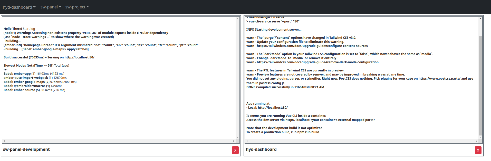

docker-watcher
==============

This is a browser based docker logs viewer intended to be used with k8s Kubernetes deployments.
Provides side-by-side view of logs which is handy when developing microservices talking to each other...

This tool was created as a part of an IT OKR objective.

### Technology

Docker-watcher uses Eel (https://github.com/ChrisKnott/Eel) which is a gevent/webservices framework.
It allows calling frontend JS functions from backend and vice-versa. Handy for streaming docker logs to web fronted.

Aside of that Docker API Python library and some standard jQuery/Bootstrap on the frontend.

### Usage

Edit `settings.py` and list your k8s services/deployments you want to list/group by.
For example you can have multiple docker containers for one microservice like:

```angular2html
k8s_sw-tomato-worker-...
k8s_sw-tomato-api-...
k8s_sw-tomato-admin-...
```
And you can group by them by specifying `sw-tomato` as the microservice. The app looks for containers starting with `k8s_{NAME}`.

Next install requirements and run `app.py`:

```angular2html
python app.py
```

This should open a browser window (Chrome by default) with the application:



Logs are streamed "live" via gevent sudo-threads. When a container is restarted watcher will try to find the new one and continue streaming.


### Tests

To run tests use `pytest`

### Caveats and problems

This tools uses Eel which lacks active maintainer (which results in multiple forks). It may have problems working with newer versions of Python.

On top of that gevent monkey patching may result in unexpected behavior without clear exceptions give. A black box so don't rush with Eel to make production / critical applications ;)


### ToDo:

* container restart button
* URL highlighting
* more logs text cleaning / re-adding timestamp
